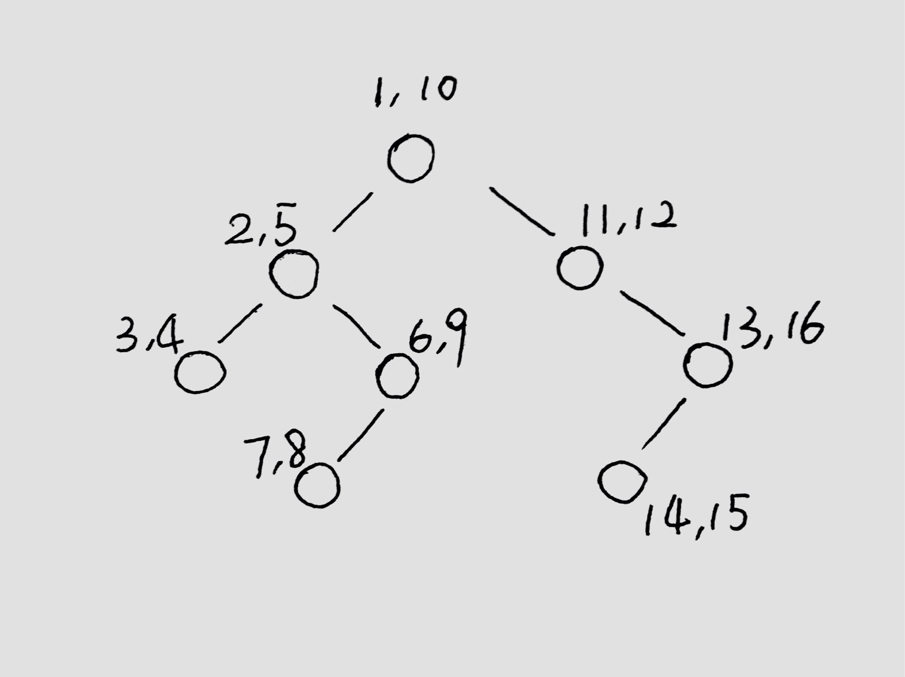

Tree
====

Tree Traversal
##############

94. Binary Tree Inorder Traversal
---------------------------------

Given a binary tree, return the *inorder* traversal of its nodes' values.

We have the following three strategies to solve this problem:

Recursion
~~~~~~~~~

Recursion is the easiest.

.. code-block:: none

    InorderTraversal(root)
        InorderTraversal(root->left)
        visit(root)
        InorderTraversal(root->right)

Iteration
~~~~~~~~~

Iteration can be implemented using **stack**. The stack stores the nodes that are **traversed** but not yet **visited**.
When we go to some node, it is said **traversed**. However, we can not **visit** it right now until its left subtree
is visited. In that case, we push it into the stack for future reference.

The overall process looks like this:

1. Keep pushing left child into the stack (if any)
2. Pop the top element (marked as **E**) from the stack, visit **E**
3. If **E** has right child, push it into the stack, go back to step 1

The figure below provides an overview of the traversal. Every node is mark with two **timestamps**:
the first one marks the time it is pushed into the stack, the second one marks the time it is visited.

Morris Traversal
~~~~~~~~~~~~~~~~

Morris traversal is also iterative. The difference is that it uses :math:`O(1)` space. Morris traversal doesn't save
unvisited nodes into stack, it borrows ideas from **threaded binary tree**: use **null** child pointer to save its
successor.

The figure below shows each iteration step for the given tree in Morris traversal (left to right, up to down). **cur**
represents the current node, and all visited nodes are marked as blue.

.. image:: images/1469707384.jpg

The overall process looks like this:

1. Set cur to root
2. If cur is null, we are done
3. If cur does not have left child, visit it, set cur to its right child, go to step 2
4. Find the predecessor of cur, mark it as prev
5. If prev does not have right child (it hasn't been threaded), point prev's right child to cur (thread it),
   set cur to its left child, go to step 2
6. Set prev's right child to null (clean the thread), visit cur, set cur to its right child, go to step 2

The pseudo-code is shown below:

.. code-block:: none

    TreeNode *current = root;

    while (!current) {
        if (!current->left) {
            visit(current)
            current = current->right;
        } else {
            TreeNode *pred = current->left;

            while (pred->right != nullptr && pred->right != current)
                pred = pred->right;

            if (!pred->right) { // not been threaded yet
                pred->right = current;
                current = current->left;
            } else { // clean the thread
                visit(current);
                pred->right = nullptr;
                current = current->right;
            }
        }
    }

144. Binary Tree Preorder Traversal
-----------------------------------

Given a binary tree, return the *preorder* traversal of its nodes' values.

We have the following three strategies to solve this problem:

Recursion
~~~~~~~~~

Recursion is the easiest.

.. code-block:: none

    PreorderTraversal(root)
        visit(root)
        PreorderTraversal(root->left)
        PreorderTraversal(root->right)

Iteration
~~~~~~~~~

Iteration can be implemented using **stack**. The stack stores the nodes that need to been **visited** later.
When we go to some node, we first **visit** it, then we need to store its left and right child for future references.
The order we store the children matters. Since stack is a **LIFO** data structure, we should first push the right child
then the left child.

The overall process looks like this:

1. Push the root element into the stack
2. If the stack is not empty, pop the top element (marked as **E**), visit **E**. Otherwise, we are done
3. If **E** has right child, push it into the stack
4. If **E** has left child, push it into the stack, go to step 2

.. note::

    We can **NOT** use **queue** here.

    At first glance, we might think **queue** should be fine if we take care of the order:
    since queue is a **FIFO** data structure, we choose to first push the left child then the right child.
    Unfortunately, this doesn't work.

    The reason is that preorder traversal contains some kind of recursion in its definition:
    visit the node, visit the left subtree, visit the right subtree. That means all nodes in the
    left subtree should be visited **before** all nodes in the right subtree.

    In this case, only **stack** can preserve this kind of property.

Morris Traversal
~~~~~~~~~~~~~~~~

Morris traversal for preorder is much similar to inorder. The only difference is that it visits **current** node when
its predecessor hasn't been threaded.

The pseudo-code is shown below:

.. code-block:: none

    TreeNode *current = root;

    while (!current) {
        if (!current->left) {
            visit(current)
            current = current->right;
        } else {
            TreeNode *pred = current->left;

            while (pred->right != nullptr && pred->right != current)
                pred = pred->right;

            if (!pred->right) { // not been threaded yet
                visit(current); // the only difference with inorder traversal
                pred->right = current;
                current = current->left;
            } else { // clean the thread
                visit(current);
                pred->right = nullptr;
                current = current->right;
            }
        }
    }

145. Binary Tree Postorder Traversal
------------------------------------

Given a binary tree, return the *postorder* traversal of its nodes' values.

We have the following three strategies to solve this problem:

Recursion
~~~~~~~~~

Recursion is the easiest.

.. code-block:: none

    PostorderTraversal(root)
        PostorderTraversal(root->left)
        PostorderTraversal(root->right)
        visit(root)

Iteration
~~~~~~~~~

1) Using Two Stacks
*******************

When we go to some node, we should first visit its left and right subtrees. This can be interpreted as **traversing**
the node **twice** before actually **visiting** it. We can use two stacks to store the two traversals separately.
The order we store the children matters. Since the sequence get reversed when all nodes go from one stack to the other,
we choose to push the left child before the right child in the first stack.

The overall process looks like this:

1. Push the root element into the stack I
2. If the stack I is not empty, pop the top element (marked as **E**), push it into stack II. Otherwise, we are done
3. If **E** has left child, push it into the stack I
4. If **E** has right child, push it into the stack I, go to step 2

After we have done, pop all the elements in the stack II, the order is exactly the postorder.

2) Using One Stack
******************

Iteration can also be implemented in one stack. The key point is that by comparing the node pointers, we can tell
whether the **visited** node is the **left** child of the node on the **top** of the stack or the **right** child.

The overall process looks like this:

1. Push the root element into the stack
2. Keep pushing left child into the stack (if any)
3. Get the top element from the stack (marked as **E**)
4. If **E** has the right child, push it into the stack, go to step 2; Otherwise pop and visit **E**
5. If **E** is the left child of the top element from the stack and the top element has right child, push the right
   child into the stack
6. Go to step 2

The pseudo-code is shown below:

.. code-block:: none

    stack<TreeNode*> s;
    TreeNode* node = root;

    while (node || !s.empty()) {
        if (node) {
            s.push(node);
            node = node->left;
        } else {
            if (s.top()->right) {
                node = s.top()->right;
            } else {
                TreeNode* tmp;
                do {
                    tmp = s.top();
                    s.pop();
                    visit(tmp);
                } while (!s.empty() && s.top()->right == tmp);
            }
        }
    }

Morris Traversal
~~~~~~~~~~~~~~~~

Morris traversal for postorder is much more complicated. It first needs a **dump** node, then needs a subroutine to visit
the path between given two nodes reversely.

The figure below shows each iteration step in detail:

.. image:: images/1469712583.jpg

The pseudo-code is shown below:

.. code-block:: none

    // reverse the tree nodes 'from' -> 'to'
    void reverse(TreeNode *from, TreeNode *to) {
        if (from == to) return;

        TreeNode *x = from, *y = from->right, *z;

        while (true) {
            z = y->right;
            y->right = x;
            x = y;
            y = z;
            if (x == to)
                break;
        }
    }

    // visit the tree nodes 'from' -> 'to' reversely
    void visitReverse(TreeNode *from, TreeNode *to) {
        reverse(from, to);

        TreeNode *p = to;
        while (true) {
            visit(p->val);
            if (p == from)
                break;
            p = p->right;
        }

        reverse(to, from);
    }

    void postorderTraversal_Morris(TreeNode *root) {
        TreeNode dump(0);
        dump.left = root;
        TreeNode *cur = &dump, *prev = nullptr;

        while (cur) {
            if (!cur->left) {
                cur = cur->right;
            } else {
                prev = cur->left;

                while (prev->right && prev->right != cur)
                    prev = prev->right;

                if (!prev->right) {
                    prev->right = cur;
                    cur = cur->left;
                } else {
                    visitReverse(cur->left, prev);
                    prev->right = nullptr;
                    cur = cur->right;
                }
            }
        }
    }

102. Binary Tree Level Order Traversal
--------------------------------------

Given a binary tree, return the level order traversal of its nodes' values. (ie, from left to right, level by level).

Level order traversal is actually kind of breadth-first search. It is implemented using **queue**. The queue stores all
the nodes in the next level.

107. Binary Tree Level Order Traversal II
-----------------------------------------

This is the extension problem from `102. Binary Tree Level Order Traversal`_. We just need to reverse the result after
finishing the level order traversal.

103. Binary Tree Zigzag Level Order Traversal
---------------------------------------------

Given a binary tree, return the *zigzag* level order traversal of its nodes' values.

(ie, from left to right, then right to left for the next level and alternate between).

This is a customized form of traversal, which is actually an extension from `102. Binary Tree Level Order Traversal`_.

Follow the *zigzag* rule and reverse the direction when reaching to the next level.

----

The following problems are not asking for traversal directly, but can be solved by traversal in the end.

99. Recover Binary Search Tree
------------------------------

Two elements of a binary search tree (BST) are swapped by mistake. Recover the tree without changing its structure.

If we are allowed to use :math:`O(n)` space, it is relatively easy to solve.

The key insight here is that inorder traversal on a binary search tree actually visits all the elements increasingly.
Based on this fact, there are two cases we need to consider:

1) The swapped nodes are adjacent

   The output sequence of the inorder traversal should have **one** inversion, e.g. the sequence pattern might look like
   ``1 3 2 4 5 6 7``, and the inversion is ``3 2``. We need to swap ``3`` and ``2``.

2) The swapped nodes are not adjacent

   The output sequence of the inorder traversal should have **two** inversions, e.g. the sequence pattern might look like
   ``1 7 3 4 5 6 2``, and the inversions are ``7 3`` and ``6 2``. We need to swap the **first** element from the **first**
   inversion with the **second** element from the **second** inversion, that is, swap ``7`` and ``2``.

There is a programming trick to handle these two cases **consistently**:

* Find the first element that is larger than its successor starting from the beginning.
* Find the first element taat is smaller than its predecessor starting from the end.
* Swap these two elements.

What if we can only use :math:`O(1)` space?

Recall that morris traversal can accomplish the inorder traversal in `O(1)` space! The only extra thing we need to handle
is that we update the previous node whenever visiting the current one.

The pseudo-code is shown below:

.. code-block:: none

    // this routine helps detect the inversion and record the broken nodes
    void detect(pair<TreeNode *, TreeNode *> &broken, TreeNode *prev, TreeNode *current)
    {
        if (prev && prev->val > current->val) {
            if (!broken.first)
                broken.first = prev;
            broken.second = current;
        }
    }

    void recoverTree_Morris(TreeNode *root) {
        pair<TreeNode *, TreeNode *> broken;
        TreeNode *current = root;
        TreeNode *prev = nullptr;

        while (current != nullptr) {
            if (current->left == nullptr) {
                // in morris inorder traversal, visit happens here
                // replace visit with detecting inversion and updating prev
                detect(broken, prev, current);
                prev = current;
                current = current->right;
            } else {
                TreeNode *pred = current->left;

                while (pred->right != nullptr && pred->right != current)
                    pred = pred->right;

                if (pred->right == nullptr) {
                    pred->right = current;
                    current = current->left;
                } else {
                    // in morris inorder traversal, visit happens here
                    // replace visit with detecting inversion and updating prev
                    detect(broken, prev, current);
                    prev = current;
                    pred->right = nullptr;
                    current = current->right;
                }
            }
        }

        // finally fix the broken BST
        swap(broken.first->val, broken.second->val);
    }

----

The following problems are asked for checking certain property of the given tree(s). They are often checked by traversing
the whole tree(s).

100. Same Tree
--------------

Given two binary trees, write a function to check if they are equal or not.

To check if two given trees are equal or not, all we need to do is to traverse two trees simultaneously and compare each
node visited synchronously. Since tree traversal has two types of strategies: iteration and recursion. This problem can
be solved in both ways.

101. Symmetric Tree
-------------------

Given a binary tree, check whether it is a mirror of itself (ie, symmetric around its center).

The problem can be solved in two strategies similar to `100. Same Tree`_.

Recursion
~~~~~~~~~

Recursion is defined in the following steps:

1. If root is null, return true; otherwise
2. If root doesn't have children (either left child or right child), return true; otherwise
3. If root's left child value and right child value are not equal, return false; otherwise
4. Return true if root->left's left subtree is symmetric to root->right's right substree and root->left's right substree
   is symmetric to root->right's left substree; otherwise return false

Iteration
~~~~~~~~~

Check the symmetric feature level by level:

The pseudo-code is shown below:

.. code-block:: none

    bool isSymmetric(TreeNode *root) {
        queue<TreeNode *> q;
        q.push(root);
        q.push(root);

        while (!q.empty()) {
            TreeNode *l = q.front();
            q.pop();
            TreeNode *r = q.front();
            q.pop();

            if (l == nullptr && r == nullptr)
                continue;

            if (l == nullptr || r == nullptr)
                return false;

            if (l->val != r->val)
                return false;

            q.push(l->left);
            q.push(r->right);
            q.push(l->right);
            q.push(r->left);
        }

        return true;
    }

110. Balanced Binary Tree
-------------------------

Given a binary tree, determine if it is height-balanced.

The problem can be deduced to calculating the height of a binary tree. To speed up the validation, we choose to report
the inbalance immediately.

----

The following problems are about transforming the tree data structure to another form.

114. Flatten Binary Tree to Linked List
---------------------------------------

Given a binary tree, flatten it to a linked list in-place.

Recursion
~~~~~~~~~

Recursion is defined in the following steps:

1. If root's left child is null, we are done
2. Flatten root's left subtree, flatten root's right subtree
3. Find the tail of flattened left subtree, link the three parts together

Recursion without finding the tail
~~~~~~~~~~~~~~~~~~~~~~~~~~~~~~~~~~

Actually we do not need to find the tail every time we link the lists. The key observation is that the root's right
child is the tail of flattened root's left subtree; the root's left child is the tail of flattened root tree. If we pass
this information across an extra argument, we can avoid finding it every time.

The pseudo-code is shown below:

.. code-block:: none

    void FlattenBinaryTreeToLinkedList::flatten(TreeNode *root) {
        flattenRec(root, nullptr);
    }

    TreeNode *flattenRec(TreeNode *root, TreeNode *tail) {
        if (root == nullptr) return tail;

        root->right = flattenRec(root->left, flattenRec(root->right, tail));
        root->left = nullptr;
        return root;
    }

Iteration
~~~~~~~~~

The idea behind the iteration is that flattened linked list actually shows the preorder sequence. So we can almost
replay the iterative version of preorder traversal. Every time we visit a new node, the next node should be on the top
of the stack.

The pseudo-code is shown below:

.. code-block:: none

    void flattenStack(TreeNode *root) {
        stack<TreeNode *> s;

        if (root != nullptr)
            s.push(root);

        while (!s.empty()) {
            TreeNode *node = s.top();
            s.pop();

            if (node->right != nullptr)
                s.push(node->right);

            if (node->left != nullptr)
                s.push(node->left);

            node->left = nullptr;
            node->right = s.empty() ? nullptr : s.top();
        }
    }

117. Populating Next Right Pointers in Each Node II
---------------------------------------------------

Given any binary tree, populate each next pointer to point to its next right node.

If there is no space limitation, we can solve the problem by using level traversal.

What if we need to solve it in constant space?

We follow the same idea, populating the next right pointers level by level.

When populating one level, we can leverage the fact that previous level has been already populated. In that case, we can
use the next pointer to iterative all the nodes in the previous level, link all its left and right children together.

Tree Recursion
##############

116. Populating Next Right Pointers in Each Node
------------------------------------------------

Given a perfect binary tree, populate each next pointer to point to its next right node.

Use one more argument named sibling:

.. code-block:: none

    void connect_Recursive(TreeLinkNode *root, TreeLinkNode *sibling) {
        if (root == nullptr) return;

        root->next = sibling;

        connect_Recursive(root->left, root->right);

        if (sibling) {
            connect_Recursive(root->right, sibling->left);
        } else {
            connect_Recursive(root->right, nullptr);
        }
    }
